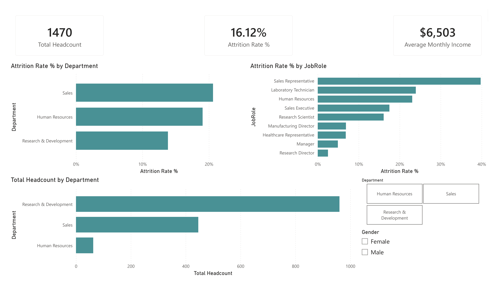
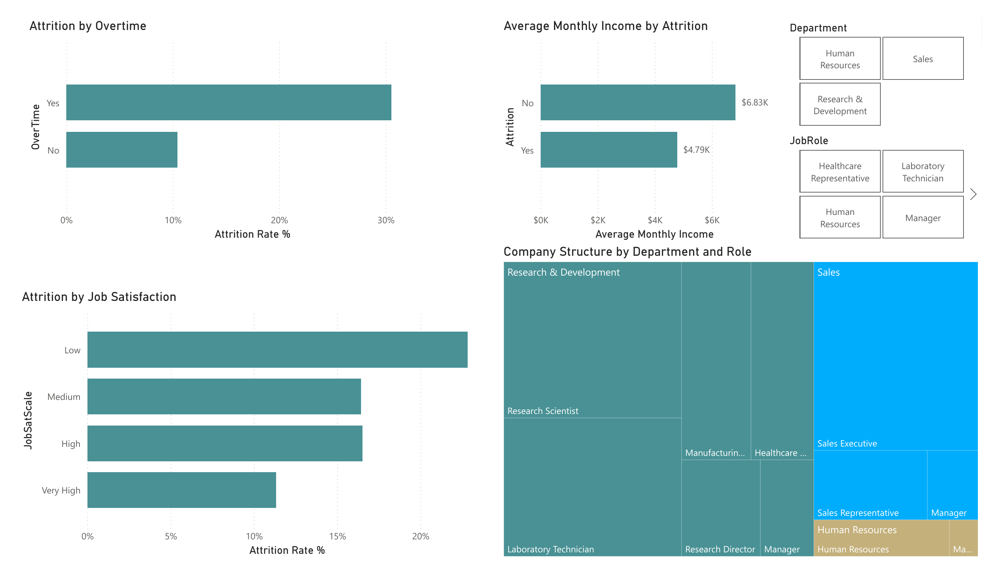

# HR Attrition Dashboard
 
A two-page Power BI dashboard exploring employee attrition drivers at a fictional company, built on top of an Excel-based data cleaning and validation workflow.

## Here are screenshots of the dashboards:

**Overview**

 
**Deep Dive**

 
## Project overview
 
This project explores 1,470 employee records from the [IBM HR Analytics Employee Attrition & Performance dataset](https://www.kaggle.com/datasets/pavansubhasht/ibm-hr-analytics-attrition-dataset) (Kaggle). The dataset is fictional, created by IBM data scientists for workforce analytics practice. The goal was to clean and validate the raw data in Excel, then build an interactive Power BI dashboard answering a few core HR questions:
 
- Which departments and job roles have the highest attrition?
- Does working overtime affect how likely someone is to leave?
- Does job satisfaction correlate with attrition?
- Do employees who leave get paid less than those who stay?

## Tools used
 
- **Excel** — data cleaning, XLOOKUP-based label mapping, pivot table validation
- **Power BI** — data modeling, DAX measures, interactive dashboard

## Process
 
1. **Data cleaning (Excel)**
   - Set correct column types (EmployeeNumber as Text, since it's an ID, not a quantity)
   - Removed three zero-variance columns (EmployeeCount, StandardHours, Over18) that carried no analytical value
   - Built lookup tables for coded numeric scales (Education, Satisfaction, Work-Life Balance, Performance Rating) and used XLOOKUP to convert codes into readable labels
   - Validated attrition rates with pivot tables (by department, by overtime) before modeling
2. **Data modeling (Power BI)**
   - No date table needed — this dataset has no transaction dates to model
   - Wrote DAX measures: Total Headcount, Total Attrition Count, Attrition Rate %, Average Monthly Income
   - Fixed satisfaction label sort order (Low → Medium → High → Very High) using Sort by Column on the original numeric scale
3. **Dashboard design**
   - Page 1 (Overview): KPI cards, attrition rate by department, attrition rate by job role, headcount by department
   - Page 2 (Deep Dive): attrition by overtime, attrition by job satisfaction, income by attrition, a treemap of company structure by department and role, with Department/JobRole slicers

## Key insights
 
- **Overtime is the strongest attrition driver in this dataset.** Employees who work overtime leave at roughly **3x** the rate of those who don't (≈30.5% vs. ≈10.4%).
- **Sales has the highest department-level attrition (~20.6%)**, followed closely by HR (~19.1%); R&D is the most stable department (~13.8%). Note HR's small headcount means its rate is more sensitive to a handful of departures than the other two departments.
- **Pay and retention are linked.** Employees who left earned an average of $4.79K/month, compared to $6.83K/month for those who stayed — roughly a 30% gap.
- **Job satisfaction shows a general downward trend in attrition** as satisfaction rises, though Medium and High satisfaction levels come out close to each other rather than stepping down perfectly, a reminder that real-world data is noisier than a clean trend line.
- **Sales Representative is the highest-risk single role**, with attrition near 40%, notably higher than any other job role in the company.

## Files in this repo
 
| File | Description |
|---|---|
| `HR_Attrition_Dashboard_PowerBI.pbix` | Power BI dashboard file |
| `HR_Attrition_Cleaned_Data.xlsx` | Cleaned dataset with lookup tables and pivot table validation |
| `screenshots/` | Dashboard page exports |
 
## Possible next steps
 
- Add a predictive model (e.g., logistic regression or decision tree) to estimate attrition risk per employee, building on the same dataset used in several published ML case studies
- Break down attrition by tenure (YearsAtCompany) to see if risk is concentrated in early tenure, late tenure, or evenly spread
- Add a distance-from-home vs. attrition view, since commute length is another commonly cited factor in this dataset
